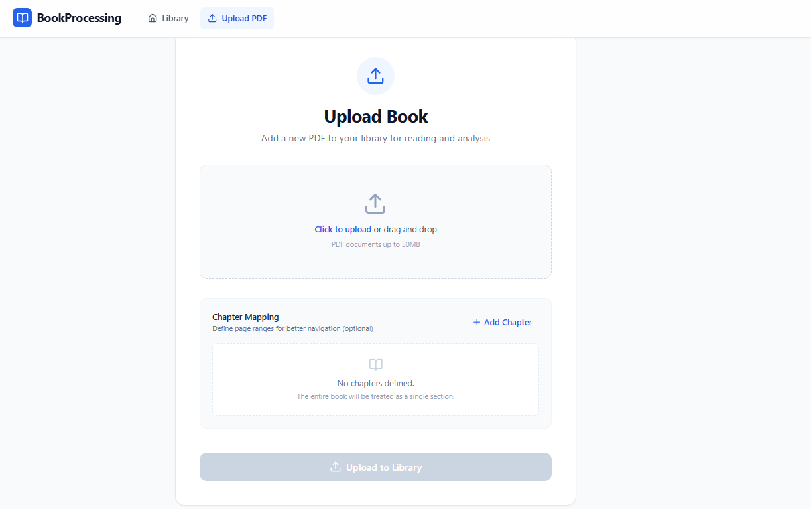
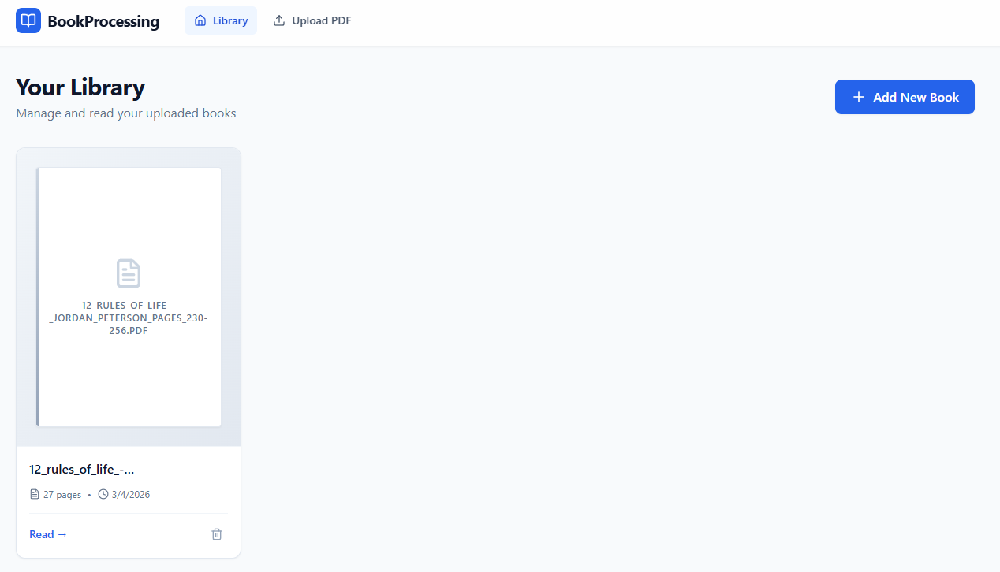
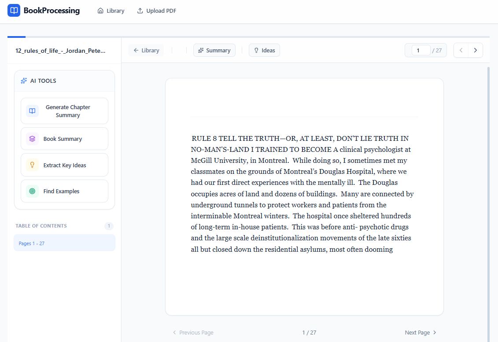
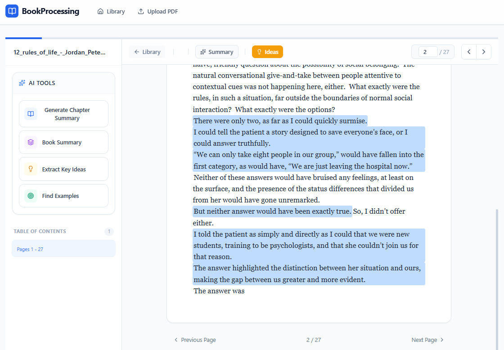
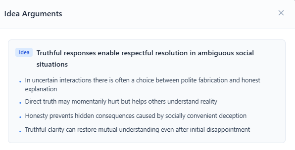

# Book Processing Web App - Frontend

## Overview

Upload, read and process books!

## App UI

<table>
    <tr>
        <td align="center">
            
             
            Upload Books
        </td>
        <td align="center">
            
             
            Home
        </td>
        <td align="center">
            
             
            Read
        </td>
        <td align="center">
            
             
            Ideas Marked
        </td>
    </tr>
    <tr>
        <td align="center">
            
             
            Idea Arguments
        </td>
    </tr>
</table>
